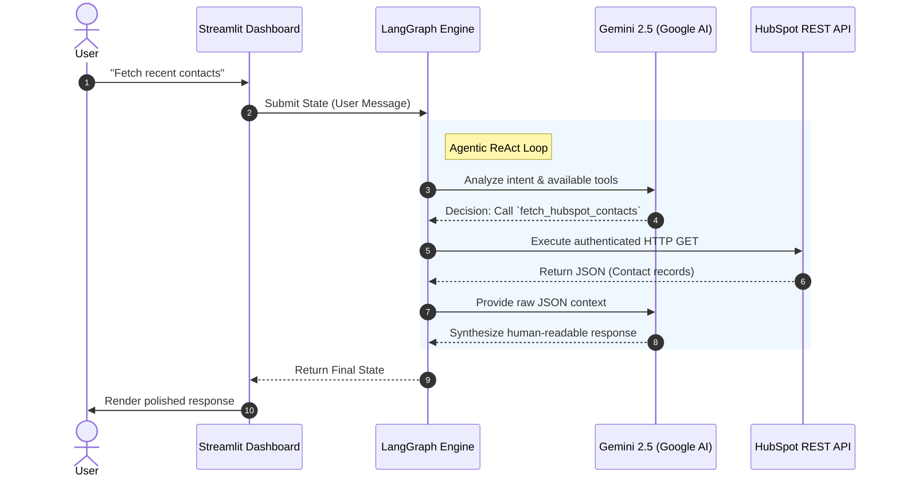

# E2E Enterprise Agent AI: CRM Integration MVP

> An enterprise-grade, autonomous AI Agent architecture demonstrating dynamic tool-calling and real-time CRM data reasoning.

## 📌 Executive Summary

This project is a Minimum Viable Product (MVP) designed to validate an **End-to-End (E2E) AI Agent pipeline**. It connects a modern chat interface with a powerful Large Language Model (LLM) orchestration engine, enabling the AI to autonomously fetch, analyze, and render live customer data from an external CRM system (HubSpot) using REST APIs.

## 🏗 Architecture & Tech Stack

The architecture is built upon industry-standard, production-ready frameworks, emphasizing modularity, security, and scalability.

- **Frontend / UI:** [Streamlit](https://streamlit.io/) (Provides a responsive, chat-based Enterprise Dashboard)
- **Orchestration Engine:** [LangGraph](https://python.langchain.com/docs/langgraph/) (Handles stateful multi-agent workflows and Tool Calling cycles)
- **LLM Foundation:** [Google Gemini 2.5 Flash](https://ai.google.dev/) (Chosen for its extreme speed and state-of-the-art native tool-calling capabilities)
- **Data Source:** [HubSpot REST API](https://developers.hubspot.com/) (Live CRM backend)

---

## ⚙️ System Workflow Diagram

The following diagram illustrates the lifecycle of a user request within the system:



## 🔐 Enterprise-Grade Design Decisions

1. **Principle of Least Privilege (PoLP):** 
   The AI Agent is strictly sandboxed. The HubSpot Private App token is scoped **exclusively** to `crm.objects.contacts.read` and `crm.objects.deals.read`. The agent physically cannot modify or delete CRM data, completely eliminating the risk of rogue AI data destruction.
2. **Stateful Graph Execution:** 
   Instead of a simple sequential chain, the system utilizes LangGraph's state machine. This allows for complex "ReAct" (Reasoning + Acting) loops, where the LLM can decide to call multiple tools sequentially or handle API errors autonomously before responding to the user.
3. **Model Agnosticism:** 
   The LLM instantiation is abstracted via LangChain. Swapping between Gemini, Anthropic (Claude), or OpenAI-compatible models (like MiniMax) requires modifying only a single line of code and the corresponding environment variable, ensuring zero vendor lock-in.

---

## 🛠 Developer Guide: How to Extend

This project is built as an **Extensible Integration Hub**. It is designed to be easily expanded with new enterprise systems (e.g., Jira, ERPs, custom internal APIs) using a Plug-and-Play architecture.

If you need to develop or extend this project, here are the key files and directories you should focus on:

### 1. The Plugin Directory (`agent/plugins/`)
This is where all external system integrations live. Each system gets its own dedicated Python file.
- `hubspot.py`: Contains the logic for fetching data from HubSpot CRM.
- `salesforce.py`: A mock implementation demonstrating how to connect to Salesforce.
**To add a new integration:** Create a new file here (e.g., `jira.py`), write your Python function using the `@tool` decorator, and implement your API logic with `try-except` enterprise error handling.

### 2. The Plugin Registry (`agent/plugins/registry.py`)
This file acts as the central switchboard.
Once you create a new plugin, you MUST import it here and add it to the `ALL_TOOLS` list. The LangGraph engine will automatically pick it up and expose it to the LLM.

### 3. The Orchestration Brain (`agent/engine.py`)
This is the core LangGraph state machine. 
If you add a new integration, you should update the `system_prompt` in this file to provide the LLM with **Semantic Routing Rules** (e.g., "If the user asks about tickets, use the Jira tool").

### 4. The Environment Template (`.env.example`)
Always document required API keys, client secrets, and base URLs for your new plugins here to maintain configuration standardization.

---

## 🚀 Quick Start Guide

### Prerequisites
- Python 3.10+
- A Google AI Studio API Key (`AQ...`)
- A HubSpot Legacy Private App Access Token (`pat-...`)

### Installation
1. Clone the repository and navigate to the root directory.
2. Install dependencies:
   ```bash
   pip install -r requirements.txt
   ```
3. Copy the environment template and configure your keys:
   ```bash
   cp .env.example .env
   # Edit .env to add your GOOGLE_API_KEY and HUBSPOT_ACCESS_TOKEN
   ```

### Execution
This architecture supports a dual-mode execution. You can run the interactive UI for demonstrations, and the headless API for external integrations simultaneously.

**1. Run the Enterprise UI (Streamlit):**
```bash
streamlit run app.py
```
*The Enterprise Dashboard will be accessible at `http://localhost:8501`.*

**2. Run the Headless API Gateway (FastAPI):**
Open a second terminal and run:
```bash
uvicorn api.main:app --reload --port 8000
```
*The API Swagger Documentation will be accessible at `http://localhost:8000/docs`.*
